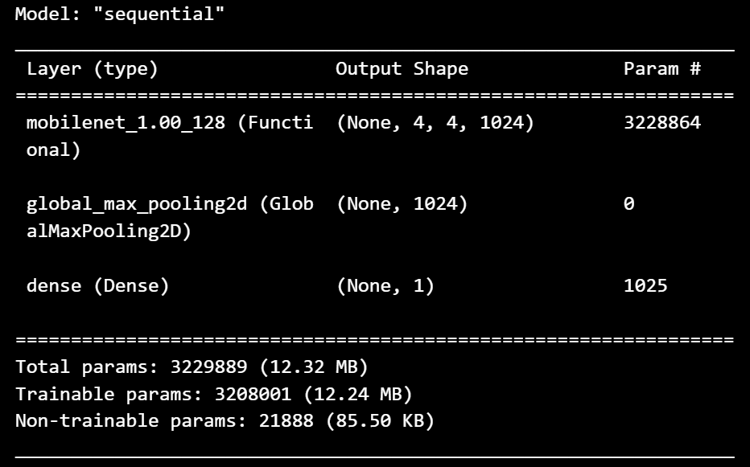

# Comment Toxicity Detection 💬🔍

<p align="center">
  
</p>

## Project Overview 🌟

This project aims to classify online comments into various toxicity categories using deep learning techniques. The model identifies comments as one or more of the following:
- Toxic
- Severe Toxic
- Obscene
- Threat
- Insult
- Identity Hate

As online platforms grow, detecting harmful content is essential for ensuring healthy interactions. This project provides an automatic system to detect toxic comments in real-time.

### Live Demo 💻

Check out the live demo of the project [here](https://huggingface.co/spaces/Yash008/comment-toxicity-detection).


The app allows users to input comments and receive a toxicity classification, along with the associated probabilities.

### Model Architecture Summary 🏗️

  

### Usefulness of the Project 📈

1. **Enhanced Online Safety**: Automatically detecting toxic comments can help maintain healthier online discussions and protect users from offensive interactions.
   
2. **Applications in Various Fields**:
   - **Social Media Platforms**: Assists in moderating user-generated content, enforcing community guidelines.
   - **Online Forums**: Helps in filtering harmful comments, promoting better user experiences.
   - **Customer Support**: Identifies toxic comments, enabling timely and effective responses.

3. **Foundation for Research**: This project provides a strong baseline for researchers working in NLP, toxicity detection, and related fields.

4. **Educational Resource**: It demonstrates the use of deep learning and NLP techniques for multi-label text classification.

## Dataset 📚

The dataset used for this project comes from the [Toxic Comment Classification Challenge](https://www.kaggle.com/c/jigsaw-toxic-comment-classification-challenge/data). It consists of labeled comments, each belonging to one or more of the toxicity categories.

- **Toxic Comment Classification Dataset**: This dataset contains text comments from Wikipedia labeled into six toxicity categories. It is widely used for building machine learning models to detect harmful comments.

## Project Workflow 🔄

1. **Dataset Collection**:
   - The dataset contains thousands of labeled comments from online platforms. Each comment is classified into one or more toxicity categories.

2. **Data Preprocessing**:
   - Comments are cleaned by removing unnecessary characters, links, and symbols.
   - The `TextVectorization` layer is used to vectorize the text data before feeding it into the model.

3. **Model Architecture**:
   - The model is a **Sequential** architecture with the following layers:
     - **Embedding** layer to convert input text into word embeddings.
     - **Bidirectional LSTM** to capture context from both directions.
     - Several **Dense** layers for classification into six categories.

4. **Training**:
   - The model is trained on the dataset with 5 epochs, with careful monitoring of validation metrics to avoid overfitting.

5. **Evaluation**:
   - The model is evaluated using accuracy, precision, and recall metrics. The evaluation helps to assess how well the model performs in detecting toxic comments.

6. **Deployment**:
   - The trained model is deployed as a Streamlit application, providing an easy-to-use interface for users to classify comments in real time.

### Preprocessing 🧹

Preprocessing the text data was crucial for improving model performance. I applied the following steps:

- Converted text to lowercase and stripped whitespace.
- Removed unwanted characters like links, symbols, and punctuations.
- Decontracted words (e.g., "don't" becomes "do not").
- Removed repetitive characters and non-English text.
- Performed basic text cleaning, ensuring only meaningful words and phrases remain.

---

### Evaluation Metrics 📈

<p align="center">
  
  
</p>


The model was evaluated using several key metrics:

- **Validation Accuracy**: `99.28%`
- **Validation Loss**: `0.0220`
- **Validation Precision**: `92.94%`
- **Validation Recall**: `81.87%`

These metrics highlight the model's ability to accurately classify toxic comments, with high precision and recall.

### Challenges Faced 🧩

While training this model, several challenges were encountered:

1. **GPU Memory Limitation**: 
   I trained this model on my system, which has an NVIDIA RTX 3050Ti with 4GB of GPU memory. During the vectorization process, the GPU memory was insufficient to handle all the text data at once. To overcome this, I batched the data during vectorization to fit into the memory constraints.

2. **Saving the Model**: 
   After training, I initially saved the model in the `.h5` format, but it caused issues in production. Therefore, I switched to saving the model in the `.keras` format, which worked seamlessly.

3. **Saving the Text Vectorization Layer**: 
   I struggled to save the `TextVectorization` layer for production. I resolved this by using `pickle` to save the vectorizer configuration and vocabulary as a dictionary. This allowed me to load the vectorizer for inference in production without issues.

---


## Getting Started 🚀

### Prerequisites

- Python 3.x
- TensorFlow (GPU or CPU version)
- Streamlit
- Other dependencies listed in `requirements.txt`

### Installation

1. Clone the repository:
   ```bash
   git clone https://github.com/yourusername/comment-toxicity-detection.git
   cd comment-toxicity-detection

### Usage 🚀


1. Running the Streamlit Application

    Run the Streamlit Application:
    ```bash
    streamlit run app/app.py

This will start a local server and open the Streamlit application in your web browser.

### Input a Comment

- Use the Streamlit app interface to input a comment.
- The app will classify the comment into one or more toxicity categories and display the results.


## Project Structure 📁

```bash

comment-toxicity-detection/
│
├── app/                     # Streamlit application
│   ├── app.py               # User app
│   ├── helper.py            # Helper functions for the app
│
├── Dataset/                 # Directory for dataset
│   └── train.csv            # Training dataset
│
├── img/                     # Images for testing the app
│
├── main.ipynb               # Jupyter notebook for the model
├── requirements.txt         # List of required packages
└── README.md                # Project documentation

```

## Contributing 🤝

Feel free to fork the repository and submit pull requests. For major changes, please open an issue to discuss the modifications you would like to make.


## Acknowledgements 🙏

- Kaggle for providing the dataset.
- TensorFlow for its deep learning framework.
- Streamlit for creating interactive web applications.


